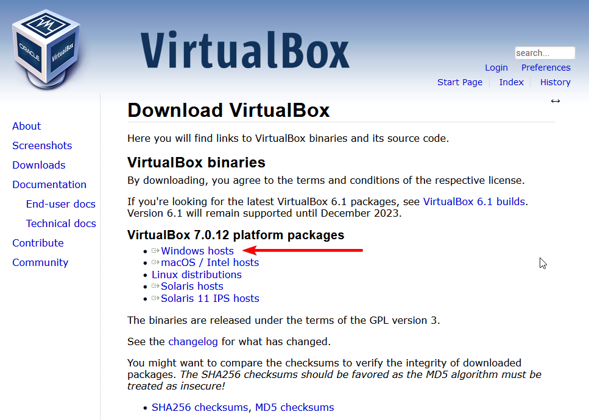

## Installation de VirtualBox
Dans le cadre de ce cours, nous allons utiliser VirtualBox comme logiciel de virtualisation. Il est disponible pour Windows, MacOS et Linux.

Il s'agit d'un logiciel libre et gratuit.

1. Télécharger et installer VirtualBox pour votre système : https://www.virtualbox.org/wiki/Downloads
  

<video src="assets/virtualbox_install.mp4" controls title="Installation de VirtualBox"></video>

> **Configuration pour version française**
>
> File --> Preferences --> Language --> Français

2. [Liens vers les machines virtuelles](https://drive.google.com/drive/folders/1SM1LTTINd7ePXygJG-Z2JetQqlLIW1rd?usp=sharing)
3. Téléchargez la machine virtuelle terminant par `.zip`
4. 