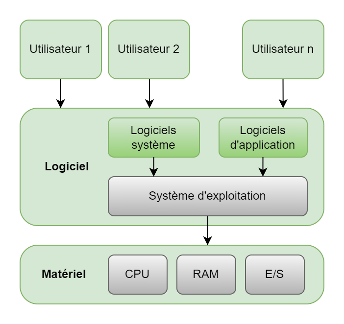
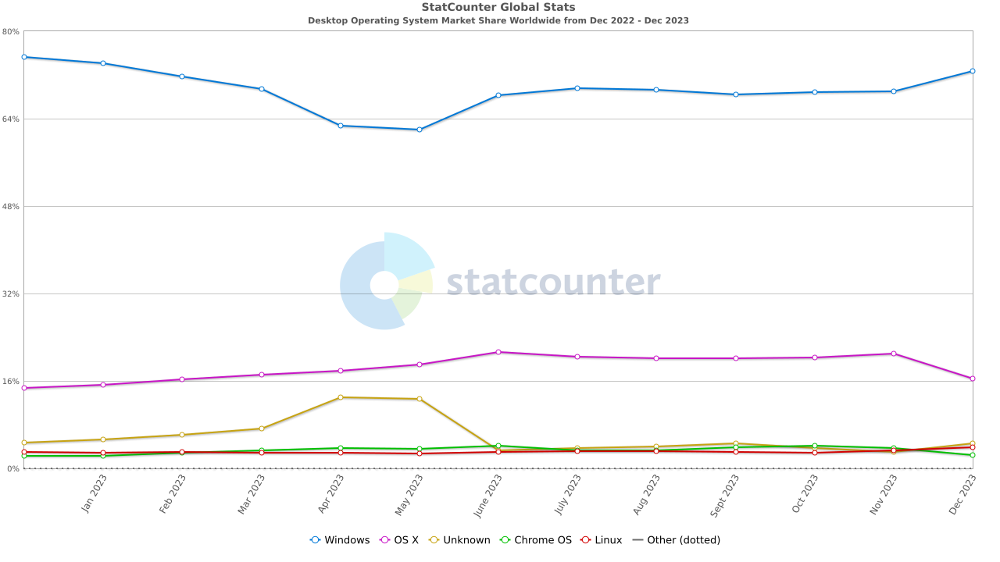
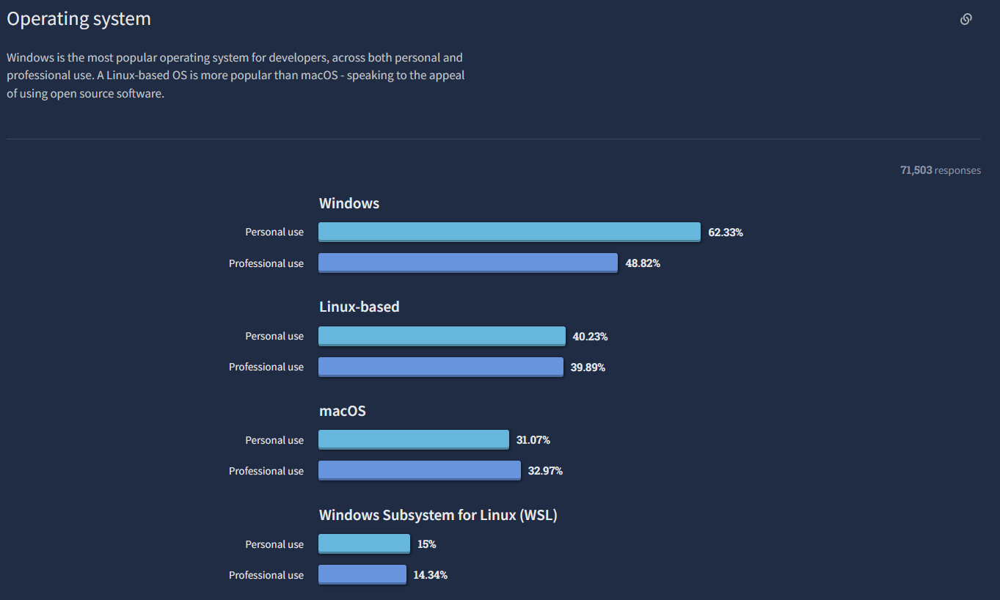
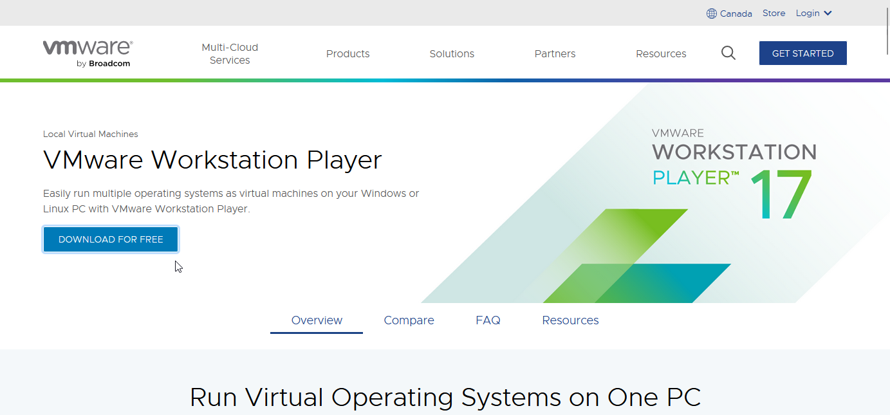
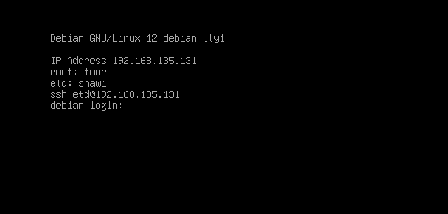
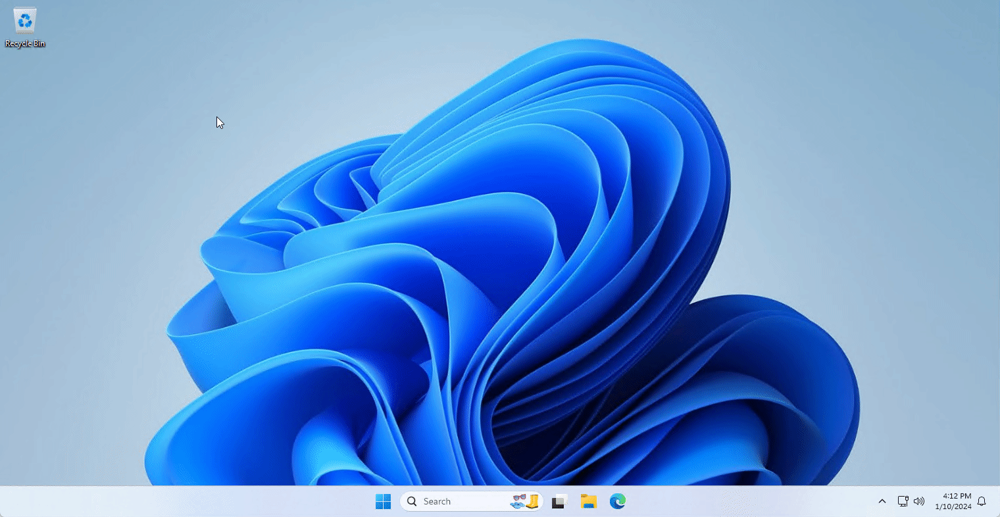
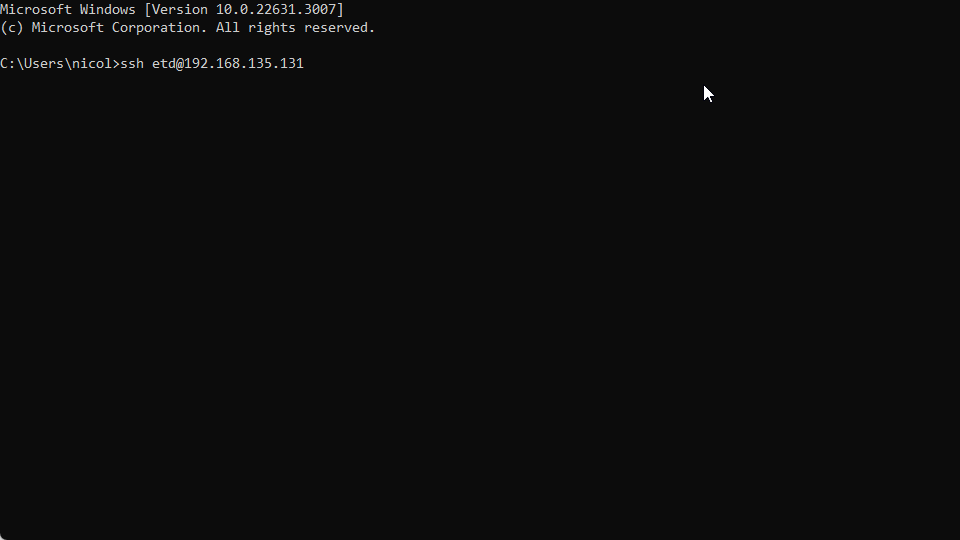
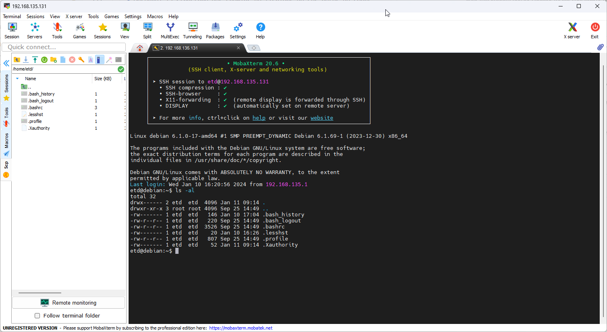

# Introduction au système d'exploitation Linux <!-- omit in toc -->

# Table des matières <!-- omit in toc -->
- [Qu'est-ce qu'un Système d'Exploitation (fr : SE, en : OS)?](#quest-ce-quun-système-dexploitation-fr--se-en--os)
  - [Analogie pour un Système d'Exploitation](#analogie-pour-un-système-dexploitation)
- [Qu'est-ce que Linux?](#quest-ce-que-linux)
  - [Linux : Un Aperçu](#linux--un-aperçu)
  - [L'utilité d'un Système d'Exploitation (OS)](#lutilité-dun-système-dexploitation-os)
  - [Linux vs Windows vs MacOS](#linux-vs-windows-vs-macos)
  - [Utilisation de Linux dans l'Industrie](#utilisation-de-linux-dans-lindustrie)
  - [Faits intéressants sur Linux](#faits-intéressants-sur-linux)
- [Pourquoi Linux?](#pourquoi-linux)
- [Poste de travail du laboratoire 1133A](#poste-de-travail-du-laboratoire-1133a)
  - [Exercices](#exercices)
- [Linux : Commandes de Base](#linux--commandes-de-base)
  - [Navigation et gestion des fichiers](#navigation-et-gestion-des-fichiers)
  - [Chemins Absolus et Relatifs](#chemins-absolus-et-relatifs)
    - [Chemin Absolu](#chemin-absolu)
    - [Chemin Relatif](#chemin-relatif)
    - [Utilisation](#utilisation)
  - [Exercices - ls](#exercices---ls)
  - [Exercices - cd](#exercices---cd)
  - [Exercices - mkdir](#exercices---mkdir)
  - [Exercices - `rm`](#exercices---rm)
  - [Exercices - `mv`](#exercices---mv)
  - [Exercices - `cp`](#exercices---cp)
- [Analyse d'une commande](#analyse-dune-commande)
  - [Exemples](#exemples)
- [Linux : Installation en machine virtuelle](#linux--installation-en-machine-virtuelle)
  - [Machine virtuelle](#machine-virtuelle)
  - [Installation de VMWare Workstation Player](#installation-de-vmware-workstation-player)
  - [Téléchargement de la machine virtuelle](#téléchargement-de-la-machine-virtuelle)
  - [Exercice](#exercice)
- [Première connexion à Linux](#première-connexion-à-linux)
  - [Connexion à distance avec `ssh`](#connexion-à-distance-avec-ssh)
- [Extras](#extras)
  - [Utilitaire dignes de mention](#utilitaire-dignes-de-mention)
- [Références](#références)

---

> ***Citation de la semaine***
> 
> "Un éléphant, ça se mange une bouchée à la fois." -Inconnu

---

# Qu'est-ce qu'un Système d'Exploitation (fr : SE, en : OS)?
- Un système d’exploitation est l’ensemble des programmes qui communiquent avec le matériel et contrôlent l’**allocation des ressources** aux autres programmes du système.
- Le système d’exploitation est un ensemble de programmes assurant la gestion de l’ordinateur et de ses périphériques. Il sert de base pour le développement et l’exécution de programmes d’applications.
- Le programme qui est toujours en fonctionnement est le **noyau**. Tout le reste est soit un "“"programme système" (vient avec le système d’exploitation) ou un programme d’application
- Le programme qui isole les programmes d'application des réalités matérielles, s'occupe :
  - de gérer tous les composants matériels de l'ordinateur
  - et d'isoler mutuellement les différentes applications et les différents utilisateurs qui se partagent la même machine



## Analogie pour un Système d'Exploitation
- C'est un illusionniste
  - Il fait disparaître certaines limites du matériel
    - Il donne l'illusion que la machine a une mémoire infinie et une infinité de processeurs

- C'est un gouvernement
  - Il protège les utilisateurs les uns des autres
  - Il partage des ressources de façon efficace et équitable

---

# Qu'est-ce que Linux?

## Linux : Un Aperçu
- **Définition** : Linux est un système d'exploitation (OS) open-source basé sur le noyau Unix.
- **Création** : Développé initialement par Linus Torvalds en 1991.
- **Philosophie** : Libre de droits, modifiable et distribuable par tous.

## L'utilité d'un Système d'Exploitation (OS)
- **Interface entre l'utilisateur et le matériel** : Facilite l'accès aux ressources matérielles de l'ordinateur.
- **Gestion des ressources** : Gère les processus, la mémoire, le stockage, les périphériques.
- **Support des applications** : Permet l'exécution et la gestion d'applications.

## Linux vs Windows vs MacOS
- **Open Source vs Propriétaire** :
  - *Linux* : Code source ouvert, modifiable par la communauté.
  - *Windows* : Propriété de Microsoft, code source non accessible.
  - *MacOS* : Propriété d'Apple, code source non accessible.
- **Personnalisation** :
  - *Linux* : Hautement personnalisable.
  - *Windows* et *MacOS* : Moins flexible en termes de personnalisation.
- **Utilisation** :
  - *Linux* : Préféré pour les serveurs, le développement, et les systèmes embarqués.
  - *Windows* : Dominant sur le marché des PC de bureau et des jeux.
  - *MacOS* : Préféré par les professionnels de la création des pays occidentaux.

## Utilisation de Linux dans l'Industrie
- **Serveurs et Cloud** : Linux domine le marché des serveurs et est largement utilisé dans les infrastructures cloud (ex. : Amazon AWS, Google Cloud).
- **Développement et DevOps** : Prisé pour sa flexibilité, sa sécurité, et ses outils de développement.
- **Systèmes Embarqués et IoT** : Linux est largement utilisé dans les systèmes embarqués grâce à sa légèreté et sa flexibilité (ex. : Android, appareils IoT).
- **Éducation et Recherche** : Utilisé dans les environnements académiques pour l'enseignement des sciences informatiques et la recherche.
- **Superordinateurs** : La majorité des superordinateurs fonctionnent sous Linux en raison de sa scalabilité et de sa robustesse.

## Faits intéressants sur Linux
Parts de marché des différents **systèmes exploitation de bureau**



On remarque que Linux est très peu utilisé sur les ordinateurs de bureau. Cependant, il s'agit des utilisateurs généraux.

Si on regarde maintenant auprès des développeurs...



On remarque que l'utilisation de Linux n'est pas négligeable. Il s'agit de la deuxième plateforme la plus utilisée par les développeurs. Les données proviennent de Stack Overflow avec leur sondage annuel 2022 auprès de plus de 70k développeurs.

Linux est aussi très utilisé dans les serveurs, les appareils mobiles et appareils IoT.

- Les appareils mobiles?? Oui, Android est basé sur Linux!
- Il y a aussi de forte chance que ton router à la maison soit basé sur Linux.

---

# Pourquoi Linux?
La connaissance des bases de Linux est cruciale pour toute personne évoluant dans le domaine de l'informatique pour plusieurs raisons :

- **Prévalence dans les Serveurs et le Cloud** : Linux domine le marché des serveurs et est largement utilisé dans les infrastructures de cloud computing. Les compétences en Linux sont essentielles pour gérer ces environnements, notamment pour le déploiement d'applications, la gestion de bases de données, et l'administration de serveurs.

- **Environnement de Développement Polyvalent** : Plusieurs entreprises utilises l'environnement Linux pour effectuer le développement, en particulier pour le développement de systèmes, d'applications web, et de services en ligne.

- **Sécurité et Fiabilité** : La compréhension de Linux est fondamentale pour la sécurité informatique. Linux est réputé pour sa robustesse en matière de sécurité, et beaucoup de pratiques et outils de sécurité sont basés ou optimisés pour Linux.

- **Compétences en Scripting et Automatisation** : La maîtrise de la ligne de commande Linux et du scripting shell est précieuse pour l'automatisation de tâches, la gestion de systèmes, et le déploiement de logiciels, rendant les processus plus efficaces et moins sujets aux erreurs humaines.

- **Carrière et Opportunités Professionnelles** : De nombreuses carrières en informatique, telles que l'administration de systèmes, le développement de logiciels, le DevOps, et la cybersécurité, exigent une connaissance de Linux. La maîtrise de Linux peut ouvrir la porte à un large éventail d'opportunités professionnelles.

- **Fondation pour l'Apprentissage de Technologies Avancées** : Beaucoup de technologies émergentes et avancées, comme le cloud computing, les conteneurs (Docker, Kubernetes), et l'Internet des Objets (IoT), sont fortement basées sur Linux. La compréhension de Linux est donc un prérequis pour travailler avec ces technologies.

En résumé, la connaissance de Linux est un atout majeur dans le domaine de l'informatique, non seulement en raison de sa présence omniprésente dans les technologies modernes, mais aussi parce qu'elle fournit une base solide pour comprendre les principes fondamentaux de l'informatique et pour développer des compétences techniques avancées.

Il s'agit d'un système d'exploitation qui agit principalement dans l'ombre, mais qui est essentiel pour le fonctionnement de notre monde moderne. Il est donc important de comprendre ce qu'est Linux, comment il fonctionne, et pourquoi il est si important.

---

# Poste de travail du laboratoire 1133A
- Les postes de travail du laboratoire 1133A sont des ordinateurs Linux.
- Il s'agit de la distribution Debian avec l'environnement graphique KDE.
- Le compte utilisateur pour le cours sera `etdse`. Je vous donnerai le mot de passe en classe.

## Exercices
- Ouvrir l'ordinateur en face de vous.
- Pour le groupe 1, connectez-vous avec le compte groupe 1 : `etdse` et pour le groupe 2 : `etdos`.
  - Je vous donnerai le mot de passe en classe.
  - Indice pour le prof : `ZXRkc2U6czEyM2UKZXRkb3M6bzc4OXM=` <!-- Base 64 -->
- Quels sont les navigateurs qui sont installés? (2 minutes)
  - Comment vous vous y êtes pris pour trouver les navigateurs?
- Ouvrez le terminal. (3 minutes)
  - Comment ouvrir un terminal?
  - Comment vous vous y êtes pris pour trouver

**Configuration du bureau pour le cours**
Nous allons configurer le bureau pour voir le contenu du dossier `Desktop` sur le bureau.

1. Cliquez avec le bouton droit sur le fond d'écran.
2. Dans le menu contextuel, sélectionnez `Configure Desktop`.
3. Dans la fenêtre qui s'ouvre, dans la liste défilante `Layout`, sélectionnez `Folder View`.
4. Faites `Apply` et `OK`.

---

# Linux : Commandes de Base
Pendant l'ensemble du cours, nous allons utiliser la ligne de commande pour interagir avec Linux. Il est donc important de connaître les commandes de base.

## Navigation et gestion des fichiers
Comme n'importe système d'exploitation, Linux possède un système de fichiers. Il est donc possible de créer, modifier, supprimer des fichiers et des dossiers.

Comme indiqué à plusieurs reprises, nous allons utiliser la ligne de commande pour interagir avec Linux.

| Commande | Description | Usage | Exemples |
|----------|-------------|-------|----------|
| `ls`     | Affiche le contenu d'un répertoire. | `ls [options] [fichier/dossier]` | `ls`, `ls -l`, `ls -a` |
| `pwd`    | Affiche le chemin du répertoire de travail actuel. <br/> `pwd` tient pour **p**rint **w**orking **d**irectory.| `pwd` | `pwd` |
| `cd`     | Change le répertoire courant. <br/> `cd` tient pour **c**hange **d**irectory. | `cd [chemin/du/répertoire]` | `cd /home/user`, `cd ..`, `cd` ou `cd ~` |
| `mkdir`  | Crée un nouveau répertoire.  <br/> `mkdir` tient pour **m**a**k**e **dir**ectory. | `mkdir [nom_du_répertoire]` | `mkdir photos` |
| `mv`     | Déplace ou renomme des fichiers/dossiers.  <br/> `mv` tient pour ***move***| `mv [source] [destination]` | `mv fichier1 dossier/`, `mv fichier1 fichier2` |
| `cp`     | Copie des fichiers ou des répertoires. | `cp [source] [destination]` | `cp fichier1 dossier/`, `cp -r dossier1 dossier2/` |
| `rm`     | Supprime des fichiers ou des répertoires. | `rm [options] [fichier/dossier]` | `rm fichier1`, `rm -r dossier1` |
| `touch`  | Crée un fichier vide ou met à jour la date de modification d'un fichier existant. | `touch [nom_du_fichier]` | `touch nouveau_fichier` |
| `cat`    | Affiche le contenu d'un fichier ou les *concatène**. | `cat [fichier]` | `cat fichier`, `cat fichier1 fichier2 > fichier3` |
| `history`| Affiche l'historique des commandes saisies dans le terminal. | `history` | `history` |
| `clear`  | Efface le contenu de la fenêtre du terminal. | `clear` | `clear` |
| `df -h`    | Affiche l'utilisation du disque dans un format lisible. | `df -h` | `df -h` |
| `du -h .`  | Affiche l'utilisation du disque du répertoire courant. Le point `.` signifie le dossier courant. | `du -h .` | `du -h .` |
| `exit`   | Sortir de la session utilisateur ou quitter le terminal. | `exit` | `exit` |
| `man`    | **Affiche le manuel d'utilisation d'une commande.** | `man [commande]` | `man ls`, `man cp` |

> **Note**
>
> J'ai mis en évidence la commande `man`. En effet, il s'agit de l'aide absolu pour l'ensemble des commande. Il est donc important de savoir l'utiliser.

> **Note**
>
> "Concaténer" signifie mettre bout à bout. Donc, la commande `cat fichier1 fichier2 > fichier3` va mettre le contenu de `fichier1` et `fichier2` dans `fichier3`.

---

## Chemins Absolus et Relatifs
Chaque fichier et répertoire dans un système d'exploitation est identifié par un chemin unique. Il existe deux types de chemins : les chemins absolus et les chemins relatifs.

### Chemin Absolu
- **Définition** : Un chemin absolu est l'adresse complète d'un fichier ou d'un répertoire par rapport à la racine du système de fichiers. Il commence toujours par le caractère `/` (slash), qui représente le répertoire racine.
- **Caractéristiques** :
  - Ne change pas quel que soit le répertoire de travail actuel.
  - Fournit un emplacement unique et invariable pour chaque fichier ou dossier.
- **Exemple** : `/home/utilisateur/documents/fichier.txt` est un chemin absolu qui pointe vers `fichier.txt` indépendamment du répertoire courant de l'utilisateur.

### Chemin Relatif
- **Définition** : Un chemin relatif est défini par rapport au répertoire de travail actuel. Il ne commence pas par le caractère `/`.
- **Caractéristiques** :
  - Dépend du répertoire dans lequel l'utilisateur se trouve actuellement.
  - Plus court et souvent plus pratique pour naviguer dans les répertoires proches.
- **Symboles Spéciaux** :
  - `.` (point) représente le répertoire courant.
  - `..` (deux points) représente le répertoire parent.
- **Exemple** : Si l'utilisateur se trouve dans `/home/utilisateur`, le chemin relatif `documents/fichier.txt` mène au même fichier que le chemin absolu mentionné ci-dessus.

### Utilisation
- **Choix du Chemin** : Le choix entre un chemin absolu et un chemin relatif dépend de la situation :
  - Utilisez un chemin absolu pour accéder à un fichier ou un répertoire indépendamment de votre position actuelle dans l'arborescence des fichiers.
  - Utilisez un chemin relatif pour accéder à des fichiers ou des répertoires proches de votre emplacement actuel, ce qui peut simplifier la saisie et améliorer la lisibilité des commandes.
    - Observez la structure des chemins de fichiers de ces notes de cours ([lien vers la source](https://github.com/nbourre/0q1_sys_exp_notes/raw/main/c01_intro/readme.md)). Vous remarquerez que les chemins relatifs sont utilisés pour accéder aux fichiers et répertoires dans le même dossier.

---

## Exercices - ls
Premiers exercices pour vous familiariser avec la ligne de commande.

1. Ouvrez un terminal et exécutez la commande `pwd`.
   1. Quel est le résultat affiché?
   2. Que signifie le résultat affiché?
2. Exécutez la commande `ls`.
   1. Quels sont les fichiers et répertoires dans le répertoire courant?
3. Exécutez la commande `ls -l`.
   1. Quelle est la différence avec la commande `ls`?
      - Refaites la commande `ls` si vous ne vous rappelez plus.
4. Exécutez la commande `ls -al`.
   1. Quelle est la différence avec la commande `ls -l`?
5. Exécutez la command `ls ..`.
6. Exécutez la commande `cat nomFichier.txt` où `nomFichier.txt` est un fichier qui existe dans la liste.
   1. Quel est le résultat de la commande?
   2. Faites la même commande avec l'autre fichier
   3. Faites la même commande avec un fichier qui n'existe pas.
      1. Quel est le résultat?

## Exercices - cd

1. Faites la commande `cd /`.
   1. Quel est le résultat de la commande?
   2. Quel est le répertoire courant?
   3. Quelle commande vous a permis de le savoir?
2. Faites la commande `cd /home`.
   1. Quel est le répertoire courant?
3. Faites la commande `cd ..`.
   1. Quel est le répertoire courant?
4. Faites la commande `cd`.
   1. Quel est le répertoire courant?
   2. Cette commande seul permet de revenir au répertoire personnel de l'utilisateur. 
5. Faites la commande `cd ../..`.
   1. Quel est le répertoire courant?

---

## Exercices - mkdir

1. Faites la commande `mkdir patate`.
   1. Quel est le résultat de la commande?
2. Affichez le contenu du dossier courant.
3. Navigatez dans le dossier `patate`.
4. Affichez le contenu du dossier courant.
5. Faites la commande `touch fichier1.txt`.
6. Affichez le contenu du dossier courant.
7. Faites la commande `cd ..`.
8. Affichez le contenu du dossier courant.
9. Faites la commande `ls patate`.
10. Faites la commande `mkdir patate/pomme`.
11. Naviguez dans le dossier `patate`.
12. Affichez le contenu du dossier courant.
13. Navigatez dans le dossier `pomme`.
14. Affichez le contenu du dossier courant.
15. Faites la commande `touch pomme.txt`.
16. Affichez le contenu du dossier courant.
17. Faites la commande `cd`.
18. Dans quel dossier êtes-vous?

## Exercices - `rm`

1. Allez dans le dossier `patate/pomme`.
2. Affichez le contenu du dossier courant.
3. Faites la commande `rm pomme.txt`.
4. Affichez le contenu du dossier courant.
5. Faites la commande `cd ..`.
6. Affichez le contenu du dossier courant.
7. Faites la commande `rm -r pomme`.
8. Affichez le contenu du dossier courant.
9. Qu'a fait la commande `rm -r pomme`?
10. Faites la commande `cd ..`.
11. Affichez le contenu du dossier courant.
12. Supprimez le dossier `patate`.
   
## Exercices - `mv`

1. Faites la commande `mkdir poisson`.
2. Créez un fichier vide nommé `frite.txt` dans le dossier `poisson`.
3. Affichez le contenu du dossier `poisson`.
4. Créez un dossier nommé `aquarium` dans votre dossier personnel.
5. Faites la commande `mv poisson/frite.txt aquarium`.
6. Affichez le contenu du dossier `poisson`.
7. Affichez le contenu du dossier `aquarium`.
8. Qu'est-ce que la commande `mv` a fait?
9. Faites la commande `mv aquarium/frite.txt aquarium/poisson.txt`.
10. Affichez le contenu du dossier `aquarium`.
11. Qu'est-ce que la commande `mv` a fait?

## Exercices - `cp`

1. Faites la commande `cd`.
2. Affichez le contenu du dossier courant.
3. Créez dans votre dossier personnel un dossier nommé `bocal`.
4. Faites la commande `cp aquarium/poisson.txt bocal`.
5. Affichez le contenu du dossier `aquarium`.
6. Affichez le contenu du dossier `bocal`.
7. Qu'est-ce que la commande `cp` a fait?
8. Supprimez le dossier `aquarium` et son contenu.
9. Affichez le contenu du dossier personnel.
10. Affichez le contenu du dossier `bocal`.
11. Supprimez le dossier `bocal` et son contenu.

---

# Analyse d'une commande
- Une commande *peut être* composée de 3 parties :
  - Le nom de la commande : Obligatoire
  - Les options : Optionnel
    - Une option est un paramètre qui modifie le comportement de la commande.
    - On peut chaîner plusieurs options ensemble.

Pour obtenir de l'aide sur une commande, on peut utiliser la commande `man` : 
- `man ls`
- `man cd`
- `man mkdir`
- etc.

## Exemples

- La commande `ls -l` est composée de 2 parties :
  - Le nom de la commande : `ls`
    - Affiche le contenu d'un répertoire.
  - L'option : `-l`
    - Affiche le contenu d'un répertoire en format long.
  
- La commande `ls -al` est composée de 2 parties :
  - Le nom de la commande : `ls`
    - Affiche le contenu d'un répertoire.
  - Les options : `-al`
    - Affiche le contenu d'un répertoire en format long et affiche les fichiers cachés.
    - Les options peuvent être chaînées ensemble dans ce cas-ci les options `-a` et `-l` sont chaînées ensemble.

> **Important**
>
> La casses des lettres est importante. `ls` est différent de `LS`.

---

# Linux : Installation en machine virtuelle

## Machine virtuelle
- Une machine virtuelle est un logiciel qui émule un ordinateur et peut exécuter des programmes comme s'il s'agissait d'un ordinateur réel.
- On peut installer plusieurs machines virtuelles sur une même machine physique.
- L'avantage de la machine virtuelle, vous permettra d'avoir les droits d'administration sur votre machine virtuelle. Vous pourrez donc installer des logiciels et faire des modifications sur votre machine virtuelle sans affecter votre ordinateur personnel.

## Installation de VMWare Workstation Player
Cette partie concerne l'installation sur votre poste de travail personnel.

Dans le cadre de ce cours, nous allons utiliser **VMWare Workstation Player** comme logiciel de virtualisation. Il n'est disponible pour Windows.

- Téléchargez et installez VMWare Workstation Player pour votre système : https://www.vmware.com/ca/products/workstation-player.html
   

> **Propriétaire de MacOS**
> 
> Pour ceux qui ont un Mac, vous pouvez télécharger gratuitement VM Fusion avec le compte VMWare IT Academy. Venez me voir pour obtenir les informations de connexion.

## Téléchargement de la machine virtuelle
1. À l'aide du navigateur du poste de travail
2. Téléchargez la machine virtuelle
   - [Liens vers les machines virtuelles](https://drive.google.com/drive/folders/1SM1LTTINd7ePXygJG-Z2JetQqlLIW1rd?usp=sharing)
   - VMWare le fichier terminant par `.zip`
   - VirtualBox le fichier terminant par `.ova`
  
3. Décompressez le fichier `.zip` dans un dossier de votre choix.
4. Double-cliquez sur le fichier `.vmx` pour ouvrir la machine virtuelle.
5. Cliquez sur le bouton **Play Virtual Machine** pour démarrer la machine virtuelle.

Si tout fonctionne bien, vous devriez voir l'écran suivant :



**Questions**
1. Que remarquez-vous sur l'écran? Quel genre d'information est affichée?
2. Qu'est-ce qu'une adresse IP?
3. Que signifie la ligne `root: toor`?
4. Que signifie la ligne `etd: shawi`?
5. Que signifie la ligne `debian login:`?

Toutes les réponses détaillées à ces questions seront données au courant du cours.

---


## Exercice
Avec l'information que vous avez, essayez de vous connecter sur la machine virtuelle.

---

# Première connexion à Linux
- Étant que la majorité du temps Linux est installé en tant que serveur, il est peu commun que l'on ait un accès direct à l'ordinateur.
- En général, on se connecte à un ordinateur Linux à distance. C'est ce que nous allons faire dans ce cours.
- Nous utilisons un outil nommé `ssh`.

## Connexion à distance avec `ssh`
`ssh` permet de se connecter à un ordinateur à distance et d'exécuter des commandes comme si on était directement sur l'ordinateur.

Pour se connecter à distance sur un ordinateur, il faut s'assurer qu'il soit en marche. Ensuite, on a besoin de 3 choses :

1. L'adresse IP de l'ordinateur
2. Le nom d'utilisateur
3. Le mot de passe

Le format général de la commande `ssh` est le suivant :

```bash
ssh <utilisateur>@<ip_address>
```

Donc si on se fie à l'écran de la machine virtuelle, on peut se connecter avec la commande suivante :

```bash
ssh etd@votre_adresse_ip
```

Mais où exécuter cette commande? Dans un terminal!

À partir de votre ordinateur Windows, ouvrez un terminal et exécutez la commande `ssh`.

Pour ouvrir un terminal, vous pouvez utiliser la combinaison de touche `Windows + R`, exécuter la commande `cmd` et appuyer sur `Enter`.



Une fois la ligne de commande ouverte, exécutez la commande `ssh` :



**Attention!** L'adresse sera différente pour vous. Utilisez l'adresse IP affichée sur l'écran de la machine virtuelle.

---


---

# Extras
## Utilitaire dignes de mention
**MobaXterm**
- Utilitaire gratuit pour Windows qui permet d'avoir plusieurs terminaux de plusieurs protocols différents (ssh, telnet, etc.)
- https://mobaxterm.mobatek.net/




 ---

 # Références
 - [Tutorial : The Linux command line for beginners](https://ubuntu.com/tutorials/command-line-for-beginners)