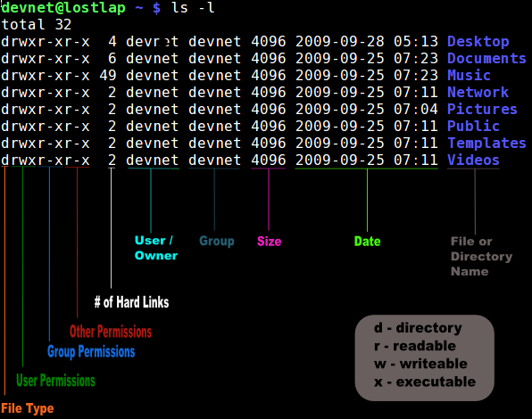

# Gestion des droits des Fichiers et Répertoires sous Linux <!-- omit in toc -->

# Table des matières <!-- omit in toc -->
- [Recapitulatif de la séance précédente](#recapitulatif-de-la-séance-précédente)
- [Introduction](#introduction)
- [Comprendre les droits des Fichiers et Répertoires](#comprendre-les-droits-des-fichiers-et-répertoires)
  - [Types de droits](#types-de-droits)
  - [Structure des droits](#structure-des-droits)
  - [Notation des droits](#notation-des-droits)
  - [Modification des droits](#modification-des-droits)
    - [Exemple pratique](#exemple-pratique)
  - [Vérification des droits](#vérification-des-droits)
  - [Résumé sur les droits des fichiers](#résumé-sur-les-droits-des-fichiers)
- [Commande `umask`](#commande-umask)
  - [Fonctionnement de `umask`](#fonctionnement-de-umask)
  - [Exemple de `umask`](#exemple-de-umask)
  - [Utilisation de `umask`](#utilisation-de-umask)
  - [Modification de la valeur de `umask`](#modification-de-la-valeur-de-umask)
  - [Importance de `umask`](#importance-de-umask)
  - [Résumé](#résumé)
- [La commande `apt`](#la-commande-apt)
  - [Syntaxe de base](#syntaxe-de-base)
  - [Commandes courantes](#commandes-courantes)
- [ACL (Access Control List)](#acl-access-control-list)
  - [Introduction aux ACL](#introduction-aux-acl)
  - [Pourquoi utiliser les ACL ?](#pourquoi-utiliser-les-acl-)
  - [Installation des outils ACL](#installation-des-outils-acl)
  - [Commandes de base pour les ACL](#commandes-de-base-pour-les-acl)
  - [Exemple d'utilisation des ACL](#exemple-dutilisation-des-acl)
  - [ACL par défaut pour les répertoires](#acl-par-défaut-pour-les-répertoires)
  - [Supprimer une ACL](#supprimer-une-acl)
  - [Points importants](#points-importants)
  - [Résumé](#résumé-1)
- [Exercices](#exercices)
  - [Gestion manuelle des droits](#gestion-manuelle-des-droits)
  - [Gestion des droits avec `umask`](#gestion-des-droits-avec-umask)
  - [Gestion des ACL](#gestion-des-acl)
- [Références](#références)

# Recapitulatif de la séance précédente
- Le système d'exploitation Linux est un système multi-utilisateurs.
- Il permet d'encapsuler les utilisateurs dans des groupes.
- Chaque utilisateur peut avoir un répertoire personnel.
- Chaque utilisateur peut appartenir à un ou plusieurs groupes.
- Par défaut, un fichier appartient à l'utilisateur qui l'a créé et au groupe par défaut de l'utilisateur.

# Introduction
Dans ce chapitre, nous allons voir comment gérer les droits des fichiers et des répertoires sous Linux.

# Comprendre les droits des Fichiers et Répertoires
Dans les systèmes Unix et Linux, chaque fichier et répertoire a des droits d'accès associés qui déterminent qui peut lire (4), écrire (2) ou exécuter (1) un fichier. Ces droits sont essentiels pour la sécurité et la gestion des données.

## Types de droits
- **Lire (r)** : Permet de voir le contenu d'un fichier ou de lister les fichiers d'un répertoire.
- **Écrire (w)** : Permet de modifier le contenu d'un fichier ou d'ajouter/supprimer des fichiers dans un répertoire.
- **Exécuter (x)** : Permet d'exécuter un fichier ou d'accéder à un répertoire.

## Structure des droits
Les droits sont définis pour trois types d'utilisateurs :
- **Propriétaire (u)** : L'utilisateur qui possède le fichier.
- **Groupe (g)** : Les membres du groupe auquel le fichier appartient.
- **Autres (o)** : Tous les autres utilisateurs.

> **Astuce perso :** Je retiens "ugo" pour "user, group, others".

## Notation des droits
Les droits sont souvent représentés sous forme octale (ex. 755) ou symbolique (ex. `rwxr-xr-x`).

Voici un exemple de sortie de la commande `ls -l` :

```bash
nbourre@PC-NICK21:~$ ls -l
total 72
-rw-r--r--  1 nbourre nbourre   480 Jan 17 15:33 0q1c02exrm
drwxr-xr-x  5 nbourre nbourre  4096 Jan 17 16:45 bash_exercises
-rwxr-xr-x  1 nbourre nbourre   910 Jan 17 16:44 cmd_rm.sh
drwxr-xr-x 24 nbourre nbourre  4096 Dec  1  2021 node_modules
-rw-r--r--  1 nbourre nbourre    92 Dec  1  2021 package.json
-rw-r--r--  1 nbourre nbourre 12404 Aug 28 09:57 package-lock.json
drwxr-xr-x  5 nbourre nbourre  4096 Aug 28 09:49 projects
drwxr-xr-x 14 nbourre nbourre  4096 Jan 24  2023 Slic3r
-rw-r--r--  1 nbourre nbourre   480 Jan 17 15:31 v8XFd
nbourre@PC-NICK21:~$
```

On remarque dans l'exemple ci-dessus un série de 10 caractères pour chaque fichier ou répertoire. L'ordre de ces caractères est le suivant :

- Format : [Type] [Usager] [Groupe] [Autres]
- Exemple : d rwx r-x r-x = 7 5 5 = 111 101 101
- Note : Les droits pour les autres (O) excluent les utilisateurs et groupes définis sur le fichier ou répertoire.

Lors de l'affichage des fichiers et répertoires, la lettre `d` indique un répertoire et le tiret (`-`) indique un fichier. Les trois premiers caractères indiquent les droits du propriétaire, les trois suivants les droits du groupe et les trois derniers les droits des autres.

Il faudra se rappeler de la conversion du binaire vers l'octal :

| Binaire | Octal | Droits       |
|---------|-------|--------------|
| 000     | 0     | Aucun droit  |
| 001     | 1     | Exécution    |
| 010     | 2     | Écriture     |
| 011     | 3     | Écriture, Exécution |
| 100     | 4     | Lecture      |
| 101     | 5     | Lecture, Exécution |
| 110     | 6     | Lecture, Écriture  |
| 111     | 7     | Lecture, Écriture, Exécution |

Ce tableau montre comment chaque combinaison de droits d'accès en binaire (pour lire, écrire, exécuter) est représentée en chiffres octaux. Cette conversion est couramment utilisée pour définir les permissions de fichiers et de répertoires dans les systèmes Unix et Linux.

L'astuce est de retenir que les valeurs de base chaque droit. Les valeurs sont 4 pour la lecture, 2 pour l'écriture et 1 pour l'exécution. Ensuite, il suffit d'additionner les valeurs pour obtenir le droit souhaité.

## Modification des droits
- **Changer les droits** : Utilisez `chmod` pour modifier les droits d'un fichier ou d'un répertoire.
  ```bash
  chmod 755 fichier
  chmod u+x fichier
  ```

  - Question : Que va faire la commande `chmod 755 fichier`? et la commande `chmod u+x fichier`?
  
- **Changer le Propriétaire ou le Groupe** : Utilisez `chown` et `chgrp`.
    ```bash
    chown utilisateur fichier
    chgrp groupe fichier
    ```

### Exemple pratique
```bash
chmod 764 fichier.txt
```

Cet exemple donne au propriétaire tous les droits, au groupe les droits de lecture et d'écriture, et aux autres uniquement le droit de lecture.

## Vérification des droits
- **Lister avec détails** : Utilisez `ls -l` pour voir les droits associés aux fichiers et répertoires.

```bash
ls -l [chemin/vers/dossier]
```

## Résumé sur les droits des fichiers
La gestion des droits des fichiers et répertoires est fondamentale pour la sécurité et l'efficacité dans les systèmes Unix et Linux. Une compréhension claire de ces concepts est essentielle pour tout administrateur système ou utilisateur avancé.



# Commande `umask`
`umask` est une commande et un concept dans les systèmes Unix et Linux qui détermine les permissions par défaut pour tout nouveau fichier ou répertoire créé par un utilisateur. `umask` agit comme un masque pour filtrer les permissions lors de la création de nouveaux fichiers et répertoires.
En d'autres termes, `umask` spécifie les permissions **qui ne seront pas accordées par défaut** lors de la création de nouveaux fichiers et répertoires.

## Fonctionnement de `umask`
- **Définition des Permissions par Défaut** : `umask` établit un ensemble de permissions qui sont **retirées** des permissions maximales autorisées lors de la création de nouveaux fichiers et répertoires.
- **Calcul des Permissions** : Les permissions réelles d'un nouveau fichier ou répertoire sont calculées en soustrayant la valeur `umask` des permissions maximales par défaut (habituellement `666` pour les fichiers et `777` pour les répertoires).

> **Note** : La raison pour laquelle les permissions de fichiers et de dossiers maximales sont différentes est que les dossiers doivent avoir des permissions d'exécution pour être accessibles.

## Exemple de `umask`
- Si `umask` est défini à `022`, les permissions retirées sont `--w--w--w-` (interdiction d'écriture pour le groupe et les autres).
- Pour un fichier, avec des permissions maximales de `666` (rw-rw-rw-), le fichier sera créé avec des permissions de `644` (rw-r--r--).
- Pour un répertoire, avec des permissions maximales de `777` (rwxrwxrwx), le répertoire sera créé avec des permissions de `755` (rwxr-xr-x).
  - Note : Les répertoires doivent avoir des permissions d'exécution pour être accessibles.

## Utilisation de `umask`

- **Vérifier la Valeur Actuelle** : 
  ```bash
  umask
  ```
- **Modifier temporairement la valeur** : 
  ```bash
  umask 027
  ```

## Modification de la valeur de `umask`
Comme indiquer précédemment, on peut modifier la valeur de `umask` temporairement avec la commande `umask`. Cependant, cette modification n'est pas permanente. Pour rendre la modification permanente, il faut modifier le fichier `~/.bashrc` ou `~/.profile`.

Pour une modification au niveau de l'utilisateur, il faut modifier le fichier `~/.bashrc` ou `~/.profile` de l'utilisateur.
Pour une modification au niveau du système, il faut modifier le fichier `/etc/bash.bashrc` ou `/etc/profile`.

Dans les deux cas, il faut ajouter la ligne suivante :
```bash
umask XXX
```

Où `XXX` est la valeur de `umask` souhaitée.

> **Note** : Pour affecter la configuration des masques pour le `ssh` pour chaque utilisateur, il faudra modifier le fichier `~/.profile`.


## Importance de `umask`
- **Sécurité** : `umask` est crucial pour la sécurité, empêchant la création de fichiers ou de répertoires avec des permissions trop permissives.
- **Environnements Multi-utilisateurs** : `umask` aide à maintenir un niveau approprié de sécurité et de confidentialité dans les environnements où de nombreux utilisateurs interagissent avec le même système.

`umask` joue un rôle essentiel dans la définition des permissions par défaut pour les nouveaux fichiers et répertoires, contribuant ainsi à la sécurité et à la gestion efficace des systèmes Unix et Linux.

## Résumé
`umask` (User File Creation Mask) est une commande essentielle dans les systèmes Unix et Linux, utilisée pour définir les permissions par défaut des nouveaux fichiers et répertoires créés par les utilisateurs. Il fonctionne en spécifiant un ensemble de permissions qui sont soustraites des permissions maximales autorisées (généralement `666` pour les fichiers et `777` pour les répertoires). Par exemple, un `umask` de `022` empêche les membres du groupe et les autres utilisateurs d'écrire dans les nouveaux fichiers (permissions résultantes `644` pour les fichiers et `755` pour les répertoires). `umask` est crucial pour la sécurité et la gestion des droits d'accès, car il assure que les fichiers et répertoires ne sont pas créés avec des permissions excessivement permissives, réduisant ainsi les risques de sécurité dans des environnements multi-utilisateurs. 

---

# La commande `apt`
La commande `apt` est un outil de gestion de paquets pour les systèmes basés sur Debian. Il permet d'installer, de supprimer et de mettre à jour des paquets logiciels. `apt` est une interface utilisateur en ligne de commande pour le système de gestion de paquets `dpkg`. Il est utilisé pour installer des paquets, rechercher des paquets et gérer les dépendances.

Les paquets sont des fichiers compressés qui contiennent des logiciels et des données. Ils sont utilisés pour installer et désinstaller des logiciels sur un système d'exploitation Linux. Les paquets peuvent être téléchargés à partir de dépôts en ligne ou installés à partir de fichiers locaux.

> **Note** : Pour pouvoir utiliser `apt` pleinement, il faut avoir les **droits administrateur** et s'il faut rechercher des paquets sur des serveurs en ligne, il faudra une connexion internet active.


## Syntaxe de base
```bash
apt [commande] [options] [paquet]
```

## Commandes courantes
- **`install`** : Installe un paquet.
  ```bash
  apt install [paquet]
  ```
  - Exemple : `apt install apache2`
  
- **`remove`** : Supprime un paquet.
  ```bash
  apt remove [paquet]
  ```
  - Exemple : `apt remove apache2`

- **`update`** : Met à jour la liste des paquets disponibles.
  ```bash
  apt update
  ```

- **`upgrade`** : Met à jour les paquets installés.
  ```bash
  apt upgrade
  ```

- **`search`** : Recherche un paquet.
  ```bash
  apt search [paquet]
  ```
  - Exemple : `apt search python` 

---

# ACL (Access Control List)

## Introduction aux ACL
Les listes de contrôle d'accès (ACL) offrent une méthode plus fine de gestion des permissions sur les fichiers et répertoires sous Linux, au-delà du modèle traditionnel de propriétaire, groupe et autres (ugo). Les ACL permettent de spécifier des permissions pour un nombre quelconque d'utilisateurs et de groupes, offrant ainsi une flexibilité accrue.

## Pourquoi utiliser les ACL ?
- **Flexibilité** : Les ACL permettent de définir des permissions pour des utilisateurs et des groupes spécifiques sans modifier les groupes ou les permissions du fichier.
- **Contrôle Granulaire** : Elles offrent un contrôle plus précis sur qui peut lire, écrire ou exécuter un fichier.
- **Gestion des Permissions** : Idéal pour les environnements où plusieurs utilisateurs travaillent sur les mêmes fichiers mais nécessitent des niveaux d'accès différents.

## Installation des outils ACL
Par défaut, les outils ACL ne sont pas installé. Vous pouvez les installer avec :

```bash
su
apt install acl
```

## Commandes de base pour les ACL
- **`setfacl`** : Définit les ACL pour un fichier ou un répertoire.
  ```bash
  setfacl [options] [utilisateur:permissions] [fichier]
  ```
  - Exemple : `setfacl -m u:usr1:rw fichier.txt`
  - Cette commande donne à l'utilisateur `usr1` les droits de lecture et d'écriture sur le fichier `fichier.txt`.
- **`getfacl`** : Affiche les ACL pour un fichier ou un répertoire.
  ```bash
  getfacl [fichier]
  ```
  - Exemple : `getfacl fichier.txt`

## Exemple d'utilisation des ACL
- **Définir une ACL** : Pour donner à l'utilisateur `johndoe` le droit de lire le fichier `document.txt` :
  ```bash
  setfacl -m u:johndoe:r document.txt
  ```

- **Afficher les ACL** : Pour afficher les ACL pour le fichier `document.txt` :
  ```bash
  getfacl document.txt
  ```
Voici la sortie de la commande `getfacl` :
```bash
# file: document.txt
# owner: etd
# group: etd
user::rw-
user:johndoe:r--
group::r--
mask::r--
other::r--
```

## ACL par défaut pour les répertoires
Les ACL par défaut peuvent être définies sur un répertoire, s'appliquant automatiquement à tous les fichiers et sous-répertoires créés à l'intérieur. Exemple :

```bash
setfacl -d -m u:johndoe:rwx /chemin/vers/repertoire
```

Cette commande donne à l'utilisateur `johndoe` les droits de lecture, écriture et exécution par défaut pour tous les fichiers et répertoires créés à l'intérieur du répertoire spécifié.

## Supprimer une ACL
- **Supprimer une ACL** : Pour supprimer une ACL pour un utilisateur ou un groupe spécifique :
  ```bash
  setfacl -x u:johndoe document.txt
  ```
  - Cette commande supprime l'ACL pour l'utilisateur `johndoe` sur le fichier `document.txt`.
- Supprimer toutes les ACL :
  ```bash
  setfacl -b document.txt
  ```
  - Cette commande supprime toutes les ACL pour le fichier `document.txt`.

## Points importants
- **Compatibilité** : Les ACL ne sont pas pris en charge par tous les systèmes de fichiers. Le système de fichiers doit être monté avec l'option `acl` pour prendre en charge les ACL.
- **Masque ACL** : Les ACL peuvent inclure un masque qui limite les permissions accordées par les ACL. Le masque est défini automatiquement en fonction des permissions du fichier ou du répertoire.
  - Le masque ACL est une mesure de sécurité pour les droits. Il s'assure que les droits accordés par les ACL ne dépassent pas les droits standards du fichier ou du répertoire.

## Résumé
Les listes de contrôle d'accès (ACL) offrent une méthode plus fine de gestion des permissions sur les fichiers et répertoires sous Linux, au-delà du modèle traditionnel de propriétaire, groupe et autres (*ugo*). Les ACL permettent de spécifier des permissions pour un nombre quelconque d'utilisateurs et de groupes, offrant ainsi une flexibilité accrue. Les ACL sont utiles pour les environnements multi-utilisateurs où des niveaux d'accès différents sont nécessaires pour les fichiers et répertoires. Les ACL peuvent être définies à l'aide des commandes `setfacl` et `getfacl`, et peuvent être appliquées par défaut à tous les fichiers et répertoires créés à l'intérieur d'un répertoire. Les ACL ne sont pas pris en charge par tous les systèmes de fichiers et nécessitent que le système de fichiers soit monté avec l'option `acl` pour être pris en charge.

---

# Exercices

## Gestion manuelle des droits
- Quelles sont les options pour la commande `chmod`?

Créez les utilisateurs suivants avec les droits qui leur sont associés.

- `usr1:usr1`
  - Dossier home: `/home/usr1`
  - L'usager `usr1` a le droit de lister, écrire et lire dans ce répertoire.
- `usr2:diffusion`
  - Dossier home: `/home/usr2`
  - L'usager `usr2` a le droit de lister, écrire et lire.
  - Le groupe `diffusion` peut lire seulement le dossier `/home/usr2`.
- `usr3:diffusion:commun:groupe3`
  - Dossier home: `/home/usr3`
  - L'usager `usr3` a le droit de lister, écrire et lire.
  - Le groupe `commun` peut lister et lire le dossier `/home/usr3`.
  - Les autres peuvent lister et lire le dossier `/home/usr3`.
- `usr4:commun`
  - Dossier home: `/home/usr4`
  - L'usager `usr4` a le droit de lister, écrire et lire.
  - Le groupe `commun` peut lister et lire le dossier `/home/usr4`.
- `usr5:commun`
  - Dossier home: `/home/usr5`
  - L'usager `usr5` a le droit de lister, écrire et lire.
  - Le groupe `commun` peut lister et lire le dossier `/home/usr5`.

Pour ceux qui terminent rapidement :

  - `usr1` peut lister, écrire et lire dans le dossier `usr1` dans le compte de `usr3`
  - `usr3` peut lister et lire dans ce dossier `/home/usr3/usr1`

## Gestion des droits avec `umask`
- Quelle est la valeur par défaut de `umask`?
- Quelle est la valeur de `umask` pour que les fichiers créés aient les droits `rw-rw-rw-`?
- Quelle est la valeur de `umask` pour que les répertoires créés aient les droits `rwxrwxrwx`?
- Quelle est la valeur de `umask` pour que les fichiers créés aient les droits `rw-r--r--`?
- Quelle est la valeur de `umask` pour que les répertoires créés aient les droits `rwxr-xr-x`?

## Gestion des ACL
- Créez un répertoire `/home/acltest` et donnez les droits suivants :
  - `usr1` a le droit de lister, écrire et lire.
  - `usr2` a le droit de lister et lire.
  - `usr3` a le droit de lister et lire.
  - `usr4` a le droit de lister, écrire et lire.
  - `usr5` a le droit de lister et lire.
  - Le groupe `commun` a le droit de lister et lire.
  - Les autres ont le droit de lister et lire. 

---

# Références
- Droits des utilisateurs et groupes : https://medium.com/@jasurbek.go.dev/users-groups-and-permissions-in-linux-1fa6d56b744a
- ACL : https://debian-facile.org/doc:systeme:acl